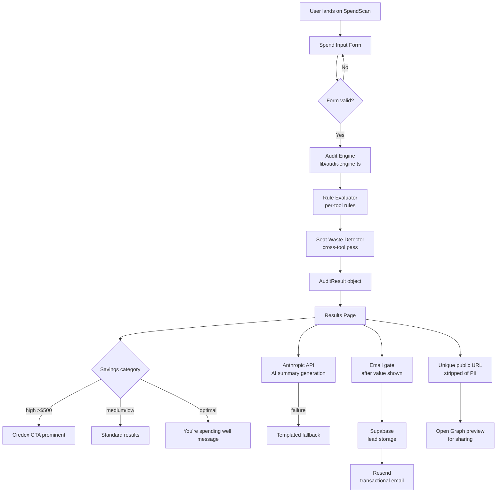

# ARCHITECTURE.md

## System Diagram

## Data Flow

1. **User input** → `AuditFormData` (tools[], teamSize, useCase) stored in Zustand, persisted to localStorage
2. **Submit** → `runAudit(formData)` in `lib/audit-engine.ts`
3. **Audit engine** iterates each enabled tool, runs rule evaluation, returns `ToolRecommendation[]`
4. **Second pass** — `detectSeatWaste()` cross-checks seats vs teamSize across all tools
5. **Result** → `AuditResult` object with totals, per-tool recs, savings category
6. **Results page** renders from the AuditResult object. AI summary fetched via `/api/summary` (Anthropic API)
7. **Lead capture** → POST `/api/leads` → Supabase insert → Resend email
8. **Share URL** → `/audit/[id]` → fetches from Supabase, strips PII fields, renders with OG tags

## Stack Choices

**Framework: Next.js 14 (App Router)**
- Server components for the landing page (fast initial load, SEO)
- Client components for the interactive form (Zustand, event handlers)
- API routes for lead capture, AI summary, and data fetching
- Built-in OG image generation via `next/og`
- One-command Vercel deploy
- Alternative considered: SvelteKit — smaller bundle, but smaller hiring pool and fewer teammates could contribute quickly

**TypeScript**
- Strict mode enabled. The audit engine has complex discriminated union types — TypeScript catches category mismatches at compile time, not runtime.

**Tailwind + custom CSS variables**
- Tailwind for utility classes, CSS variables for the design system tokens
- No component library — the UI is simple enough that a library would add bundle weight without benefit
- Alternative considered: shadcn/ui — good for forms, but overkill for this scope

**Zustand with `persist`**
- Minimal boilerplate. Form state persists to localStorage automatically.
- Alternative considered: React state + useEffect to sync localStorage — more code, same result

**Supabase** (Day 3+)
- Free tier covers this use case. Row-level security for lead data. Realtime not needed.
- Alternative considered: Cloudflare D1 — cheaper at scale, but more setup friction

**Resend** (Day 3+)
- Simplest transactional email API. Free tier: 3000 emails/month.

## What I'd Change for 10k Audits/Day

- **CDN-cache the results page** — most audit views are reads. Cache at the edge (Cloudflare) with short TTL.
- **Rate limit the API routes** — currently using a simple in-memory rate limiter; at 10k/day, move to Redis (Upstash) for distributed rate limiting.
- **Async AI summary** — move Anthropic API call to a background job (Inngest or Trigger.dev). Return results immediately, poll for summary.
- **Separate read/write DB** — Supabase read replicas or a dedicated analytics DB (ClickHouse) for aggregate stats (benchmark mode).
- **Monitoring** — add Sentry for error tracking, PostHog for funnel analytics.
